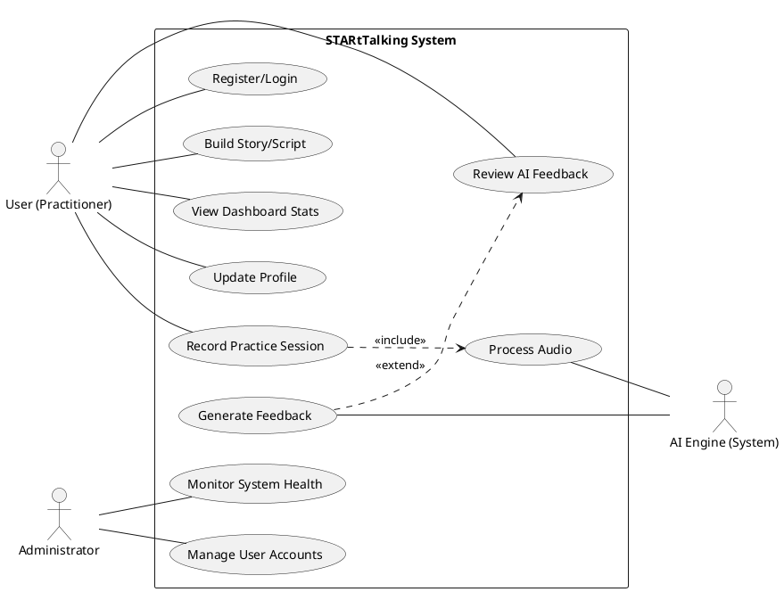
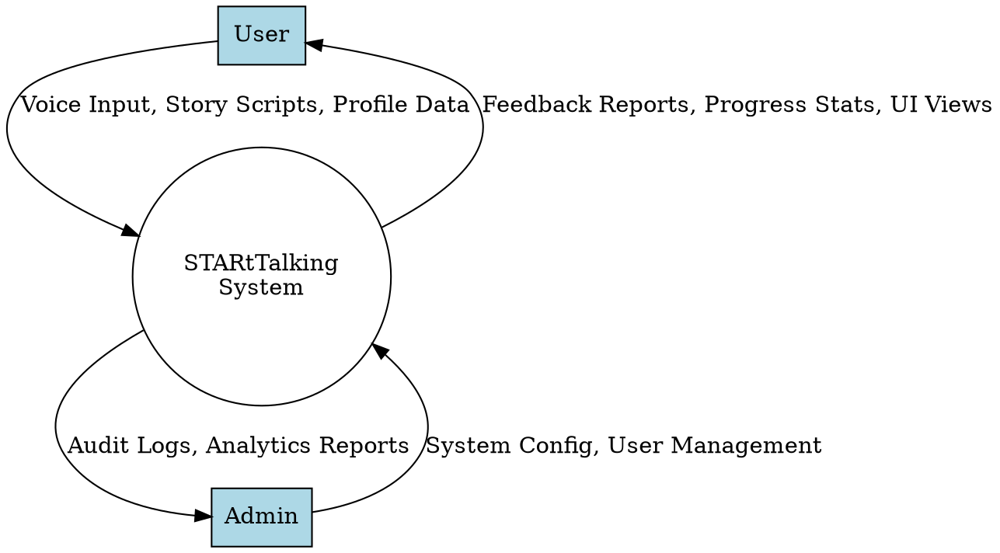
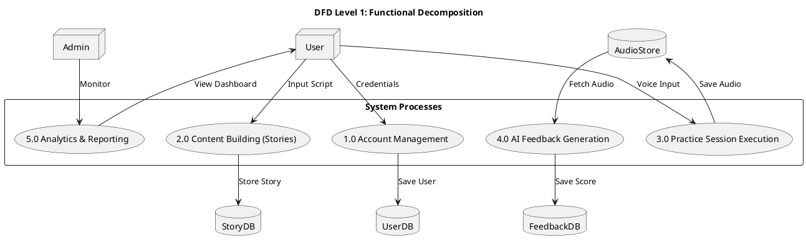
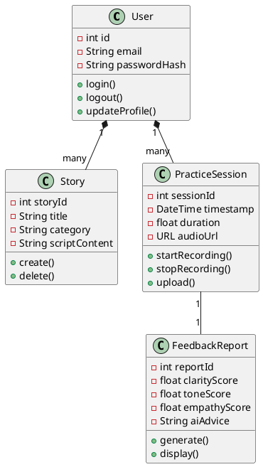
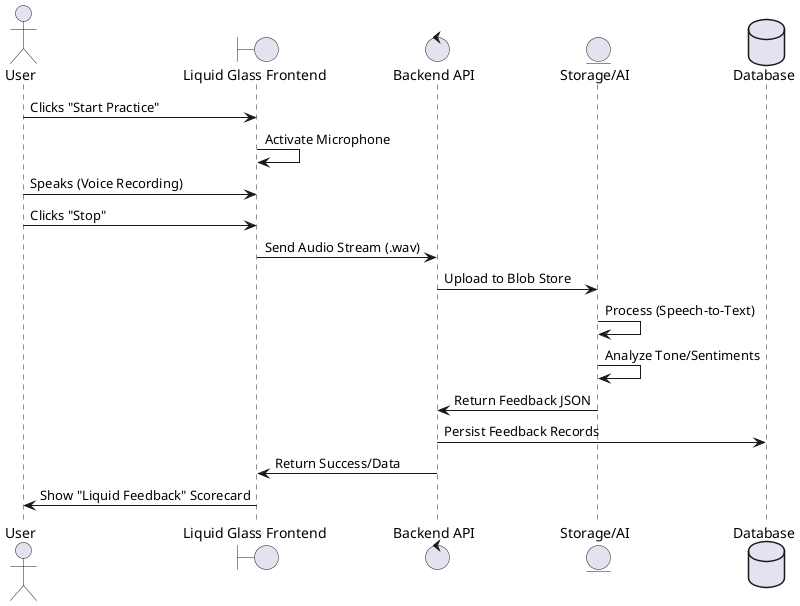
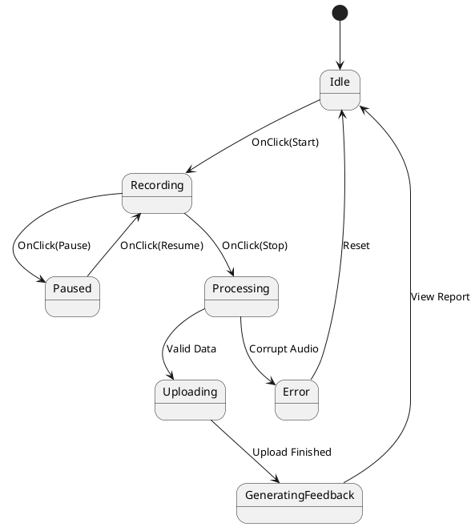
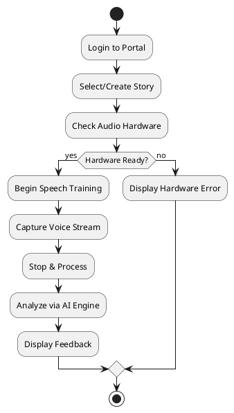
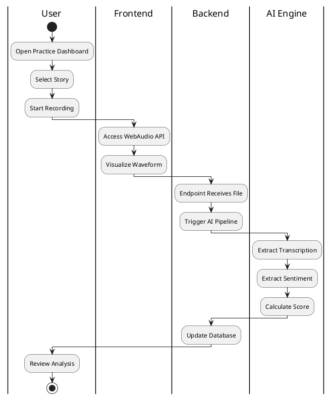

# STARtTalking: System Architecture and UML Diagram Definitions

This document contains the source code for all required system architecture and UML diagrams for the **STARtTalking** soft-skills development platform. These can be rendered using **PlantUML**, **GraphViz (DOT)**, or online editors like [PlantText](https://www.planttext.com/).

---

## 🏗️ 1. System Architecture (PlantUML)
```plantuml
@startuml
!include <azure/AzureCommon>
!include <azure/Web/AzureAppService>
!include <azure/Databases/AzureCosmosDb>
!include <azure/AI/AzureCognitiveServices>
!include <azure/Networking/AzureContentDeliveryNetwork>

title STARtTalking: Cloud-Native System Architecture (Liquid Glass UI Implementation)

package "Client-Side (React + Vite)" {
  component [Liquid Glass Frontend] as frontend
  component [Speech Recording Engine] as recorder
}

package "API Gateway & Application Layer" {
  component [Node.js / Express Server] as backend
  component [Authentication Service] as auth
}

package "AI & Intelligence Services" {
  component [Azure Speech-to-Text] as stt
  component [OpenAI GPT-4 Analysis] as ai
  component [Sentiment & Tone Analyzer] as tone
}

package "Persistence Layer" {
  database "CosmosDB (NoSQL)" as db
  storage "Azure Blob (Audio Storage)" as blob
}

' --- Connections ---
frontend --> backend : REST / GraphQL APIs
frontend --> recorder : Native Browser Audio API
backend --> auth : JWT Validation
backend --> db : JSON Persistence
recorder --> blob : Upload .wav / .webm
blob --> stt : Audio Processing Stream
stt --> ai : Text Data
ai --> tone : Contextual Feedback
tone --> backend : Structured Feedback JSON
backend --> frontend : Render Feedback View
@enduml
```

---

## 📋 2. Use Case Diagram (PlantUML)


---

## 🏗️ 3. Data Flow Diagrams (DFD)

### Level 0: Context Diagram (DOT)


### Level 1: Core Process DFD (PlantUML)


---

## 🗄️ 4. Class Diagram (PlantUML)


---

## 🔄 5. Sequence Diagram: Practice Flow (PlantUML)


---

## ⚡ 6. State Diagram: Recording Process (PlantUML)


---

## 🔗 7. ERD: Chen Notation (PlantUML)
```plantuml
@startuml
left to right direction
skinparam linetype ortho

' Entities
node "USER" <<entity>> as user
node "STORY" <<entity>> as story
node "PRACTICE_SESSION" <<entity>> as practice
node "FEEDBACK" <<entity>> as feedback

' Attributes for User
circle "UserID" as u_id
circle "Email" as u_email
circle "Password" as u_pass
user - u_id
user - u_email
user - u_pass

' Attributes for Story
circle "StoryID" as s_id
circle "Title" as s_title
story - s_id
story - s_title

' Relationships
diamond "CREATES" as creates
diamond "PERFORMS" as performs
diamond "GENERATES" as generates

user -- creates
creates -- story

user -- performs
performs -- practice

practice -- generates
generates -- feedback
@enduml
```

---

## 🌊 8. Activity Diagrams

### Without Swimlanes


### With Swimlanes (Functional Flow)

